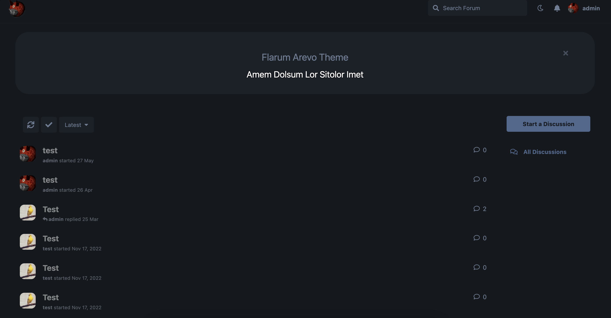

# Arevo Theme

 [](https://packagist.org/packages/freeflarum/flarum-arevo-theme) [](https://packagist.org/packages/freeflarum/flarum-arevo-theme)

A [Flarum](http://flarum.org) extension. Arevo is a simple, clean and modern theme for Flarum.



## Installation

Install with composer:

```sh
composer require freeflarum/flarum-arevo-theme:"*"
```

## Updating

```sh
composer update freeflarum/flarum-arevo-theme:"*"
php flarum migrate
php flarum cache:clear
```

## Links

- [Packagist](https://packagist.org/packages/freeflarum/flarum-arevo-theme)
- [GitHub](https://github.com/freeflarum/flarum-arevo-theme)
